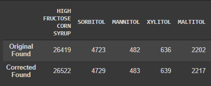

# FoodDataCentralTextCorrection
The main purpose of this tool is to fix spelling mistakes in FoodData Central's Branded Foods database. Prior to this project Cal Poly's Kinesiology Department was manually looking up mistakes in the ingredients list of the database and fixing them. The database has over 300,000 entries and it is impossible to catch and fix all spelling mistakes manually. This tool uses PeterNorvig's spell checker with the addition of the SimString library and the SymSpell libary to generate possible corrections.

# Metrics
We ran some metrics on the FoodData Central Database (Dec 2019) before and after we ran our text correction tool on it to gauge how well it performed. We specifically searched for additives listed in a document (separate from the AdditivesDict.txt) to help with analysis. The original database was able to find 784,122 instances of additives. In our newly generated database, we were able to discover a total of 791,666 instances of additives (0.96% more additives or an additional 7,544 additives).

*Screenshot of a few additives we tried to identify - before/after text correction*



More information on how we generated these metrics can be found on our [Colab Notebook](https://colab.research.google.com/drive/1Msg6jeceHIt4k7bX0xlOu0wufxibykBu?usp=sharing).

# Usage
1) Download the files as a zip folder and unzip them to C:\Users\YOURUSERNAME\Desktop\FoodDataCentralTextCorrection
2) Download the [branded foods database](https://data.nal.usda.gov/dataset/usda-branded-food-products-database) as a CSV file from FoodData Central and save it in the same directory as the tool.
3) Open command prompt and type in: 

 - ```cd Desktop/FoodDataCentralTextCorrection```

  The path on the command prompt should be: C:\Users\YOURUSERNAME\Desktop\FoodDataCentralTextCorrection.
  
4) Install python 3 by following this [tutorial](https://phoenixnap.com/kb/how-to-install-python-3-windows).
5) Verify your python installation by typing ```python``` in your command prompt. It should look like [this](https://drive.google.com/file/d/17EINfJJ662u4BVEOv0mUANDx8q_GLqis/view).
6) Run the following commands in command prompt: 
- ```pip install pandas```
- ```pip install nltk```
- ```pip install simstring```
- ```pip install symspellpy```
7) Add any words you would like to correct to the AdditivesDict.txt file.
8) Run the program by typing: ```python prototype.py```.
9) Ignore any DtypeWarnings. 
10) A text file called cleaningOutput.txt should be generated. This file contains details of the word corrections. 
11) The output from the tool will be a new CSV named new_branded_food.csv. It has the same content as branded_food.csv with an additional column called ingredients_corrected. This column contains the ingredients with corrected spellings in a list. This tool will take a couple hours to run since it has to iterate through the entire database and the new CSV will be outputted at the very end. 

# Notes
Please note that this tool is not perfect - you may need to review the cleaningOutput.txt to ensure words aren't being mistakenly replaced. We have refined the AdditivesDict.txt to the best of our ability but it may not catch everything.
If you find that some words are being replaced when they shouldn't, here is how to remedy it.

While reviewing the cleaningOutput.txt, you may come across an ingredient being mistakenly corrected like so:

```REPLACED 'ALLULOSE' with 'CELLULOSE' using SymSpell```

Uh oh! We don't want Allulose to be replaced with Cellulose.
To prevent this from happening, we simply add 'allulose' to our AdditivesDict.txt and rerun the tool.